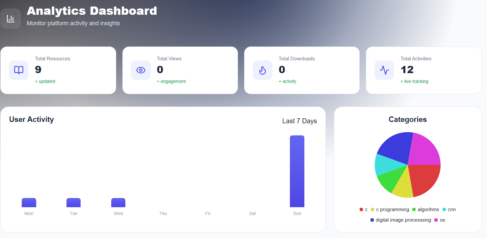
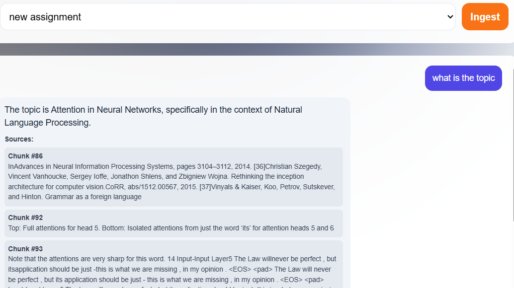
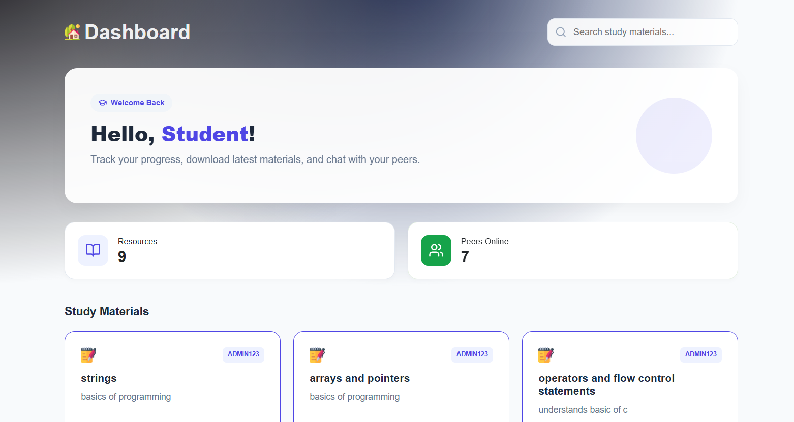
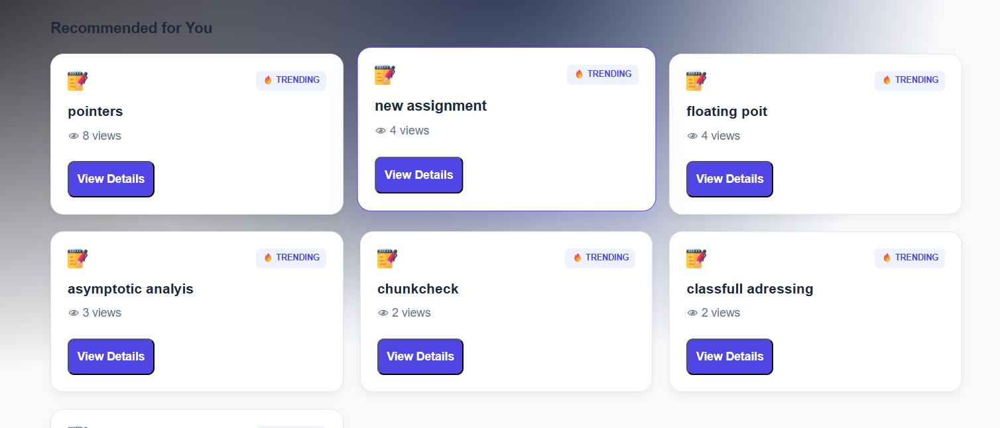
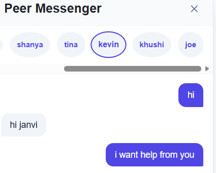

<div align="center">

<p align="center">
  
</p>

The name **Cloudora**  combines:
 ☁️ **Cloud** : Represents the platform's ability to store and manage academic resources on cloud infrastructure, making them accessible anytime and from anywhere.
 ✨ **Aura** : Represents a collaborative learning environment where knowledge is shared, organized, and easily accessible.

</div>

---

## 🚀 Overview

Cloudora is a full-stack intelligent learning platform that tracks user activity and delivers personalized educational resources using a behavior-driven recommendation system.

It combines:

* Activity tracking
* Recommendation engine
* Analytics dashboard
* Notification system
* RAG-based document Q&A (AI assistant)

---

## ✨ Key Features

### 👤 Authentication & Roles

* Secure authentication system
* Role-based access (Student / Admin)
* Protected routes

---

### 📚 Resource Management

* Add and manage learning resources
* Fields:

  * Name
  * URL
  * Category (optional)
* Tracks views and engagement

---

### 🔥 Trending System

* Auto detects popular resources
* Based on user interactions and views

---

### 🧠 Recommendation System

* Tracks user behavior (clicks, views)
* Generates personalized recommendations
* Dynamic ranking of resources

---

### 📊 Analytics Dashboard

* User activity insights
* Resource engagement metrics
* Most viewed resources
* System usage statistics

---


### 📄 RAG-based Document Q&A

* Upload PDF documents (Admin)
* Automatic chunking & embedding
* Semantic search over documents
* LLM-powered contextual answers

---
### 🔔 Notification System

* New resource alerts
* update resource

---

### 💬 Real-time Chat System (WebSocket)
- Live chat between users / admin (based on roles)
- Built using WebSockets for real-time communication
- Instant message delivery without page refresh
- Persistent connection for low-latency interaction

## 🛠️ Tech Stack

### Frontend


### Backend


### Database


---


<h2 align="center">📸 Screenshots</h2>

<table align="center">
<tr>
<td align="center">
<b>📊 Analytics Dashboard</b><br><br>

</td>

<td align="center">
<b>🤖 AI Assistant</b><br><br>

</td>
</tr>

<tr>
<td align="center">
<b>🏠 Student Dashboard</b><br><br>

</td>

<td align="center">
<b>🎯 Recommendations</b><br><br>

</td>
</tr>

<!-- <tr>
<td colspan="2" align="center">
<b>💬 Peer Messenger</b><br><br>

</td>
</tr> -->
</table>


## 📁 Project Structure

```bash
Cloudora/
│── Backend/            # Node.js backend (APIs, auth, logic)
│── Backend-AI/         # FastAPI backend (RAG / AI services)
│── Frontend/           # React frontend (UI)
│── .idea/              # IDE config files
│── package.json        # Root dependencies (if any)
│── .gitignore
│── README.md
```

---

## ⚙️ Installation & Setup

### 1️⃣ Clone Repository

```bash
git clone https://github.com/your-username/cloud-student-resource-platform.git
cd cloud-student-resource-platform
```

---

### 2️⃣ Start AI Backend (FastAPI)

```bash
cd Backend-AI
uvicorn app:app --reload --port 8000
http://localhost:8000/docs#/
```

---

### 3️⃣ Start Main Backend (Node.js)

```bash
cd Backend
npm install
npm start
```

---

### 4️⃣ Start Frontend (React)

```bash
cd Frontend
npm install
npm run dev
```

---

## 🎯 Project Highlights

* Real-world recommendation system
* Hybrid architecture (Node.js + FastAPI)
* Activity-based personalization
* Analytics-driven insights
* Modular and scalable design

---

## 🔐 Environment Variables

### Backend (Node.js)

Create `Backend/.env`:

```env
MONGO_URI=your_mongodb_connection_string
JWT_SECRET=your_jwt_secret_key
RAG_URL=http://localhost:8000
OPENAI_API_KEY=your_openai_key
EMBED_API_URL=http://localhost:8000/embed
```

---


### Frontend (React)

Create `Frontend/.env`:

```env
VITE_API_URL=http://localhost:5000

```

---


